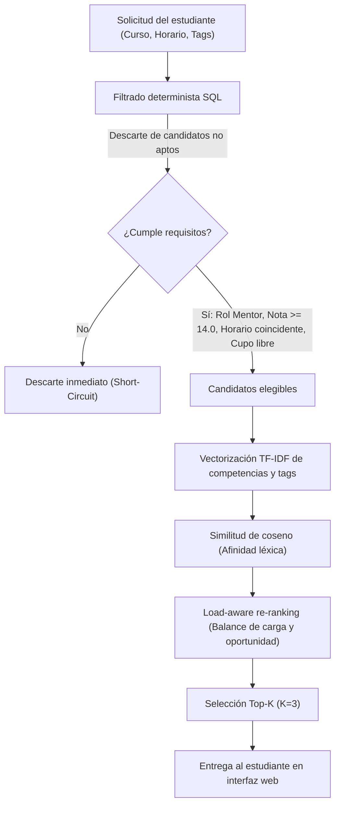

# Sistema Web P2P de Mentorías Académicas - EPIS UPT

[](https://www.python.org/)
[](https://streamlit.io/)
[](https://scikit-learn.org/)
[](https://sqlite.org/)
[]()
[](https://www.upt.edu.pe/)

Plataforma web *peer-to-peer* (P2P) con motor de recomendación híbrido para emparejar estudiantes que solicitan apoyo académico con mentores pares aptos, optimizando afinidad temática y balance de carga operativa.

> **Estado del proyecto:** Prototipo experimental en fase de análisis y validación metodológica para tesis de ingeniería. El algoritmo y sus parámetros se encuentran actualmente en evaluación sobre un dataset sintético reproducible. No representa todavía un sistema institucional formalmente desplegado en producción.

---

## 📌 Estado del proyecto

| Aspecto | Detalle |
| :--- | :--- |
| **Estado** | Prototipo experimental |
| **Fase** | Análisis metodológico y validación inicial de algoritmos |
| **Datos actuales** | Perfiles sintéticos generados proceduralmente con semilla reproducible |
| **Uso actual** | Experimentación académica y desarrollo del motor de recomendación |
| **Alcance institucional** | Entorno de investigación; no constituye aún un sistema desplegado en la universidad |

---

## 🎯 Problema

En las carreras universitarias de ingeniería, particularmente en Ingeniería de Sistemas, los estudiantes de primeros ciclos con frecuencia demandan refuerzo en materias críticas de ciencias básicas y fundamentos de programación. Paralelamente, existen estudiantes de ciclos superiores con rendimiento sobresaliente que pueden desempeñarse como mentores pares.

Sin embargo, coordinar este proceso de forma manual o mediante libre afinidad genera dificultades recurrentes:
* **Fricción en compatibilidad:** Es complejo contrastar manualmente el rendimiento académico previo, los horarios de clase disponibles y los cupos de cada mentor.
* **Sobrecarga de mentores populares:** Los mentores más reconocidos o con mayor visibilidad tienden a concentrar las solicitudes, saturando su disponibilidad y afectando la calidad de las tutorías.
* **Subutilización de nuevos mentores:** Mentores aptos pero sin historial previo quedan rezagados o invisibilizados por falta de mecanismos de oportunidad.
* **Desajuste temático:** Las asignaciones sin análisis de intereses pueden emparejar estudiantes y mentores con enfoques o expectativas conceptuales distintas.

---

## 💡 Solución propuesta

El sistema propone un flujo de recomendación desacoplado en etapas que garantiza el cumplimiento de reglas académicas estrictas antes de calcular la afinidad y ajustar el ranking por disponibilidad:

```text
Solicitud del estudiante
     ↓
Filtrado de candidatos elegibles (Reglas deterministas)
     ↓
Cálculo de similitud temática (Modelado de contenido)
     ↓
Ajuste por carga y oportunidad (Load-aware re-ranking)
     ↓
Ranking Top-K de mentores recomendados
```

---

## ⚙️ Cómo funciona el sistema

1. **Recepción de la solicitud:** El estudiante indica la materia en la que solicita acompañamiento, su día y franja horaria disponible, y una descripción o etiquetas de los temas de interés.
2. **Filtrado determinista de elegibilidad:** Mediante consultas SQL relacionales sobre el historial académico, se seleccionan únicamente aquellos mentores que:
   * Hayan aprobado la asignatura con una nota mayor o igual al umbral institucional ($\ge 14.0$).
   * Tengan disponibilidad horaria explícita en el mismo día y franja solicitada.
   * Cuenten con cupos operativos disponibles ($\text{sesiones activas} < \text{máximo de cupos}$).
3. **Cálculo de afinidad temática:** A partir del vocabulario y los intereses técnicos declarados por el estudiante y los mentores elegibles, se construye una representación vectorial (TF-IDF) y se evalúa su similitud angular mediante el coseno.
4. **Re-ranking sensible a la carga (*load-aware*):** Se modula el puntaje penalizando la saturación de mentores cercanos a su capacidad máxima y otorgando un incentivo a mentores nuevos para distribuir la carga.
5. **Selección y entrega Top-K:** Se ordenan los candidatos bajo el puntaje final y se presentan las mejores $K$ opciones ($K=3$) en la interfaz web para que el estudiante elija libremente la mejor alternativa.

---

## 🏗️ Arquitectura del pipeline



---

## 📐 Modelo de ranking

El puntaje final de recomendación asignado a cada mentor elegible $m$ frente a la solicitud del estudiante $u$ se define como:

$$\text{score}(m) = \alpha \cdot \text{similarity}(u, m) - \beta \cdot \text{load}(m) + \gamma \cdot \text{newcomer}(m)$$

Donde cada componente representa:

* **$\text{similarity}(u, m)$:** Similitud de coseno entre los vectores TF-IDF construidos a partir de los requerimientos temáticos del estudiante y las áreas de dominio registradas por el mentor.
* **$\text{load}(m) = \frac{\text{sesiones\_activas}(m)}{\text{max\_cupos}(m)}$:** Fracción de carga operativa actual del mentor; penaliza a quienes tienen la mayor parte de sus cupos ocupados para evitar su saturación.
* **$\text{newcomer}(m) \in \{0, 1\}$:** Variable indicadora que otorga un bono temporal a los mentores que no registran sesiones activas previas, promoviendo la rotación de oportunidades.

> **Aviso metodológico sobre los parámetros:** Los coeficientes $\alpha$, $\beta$ y $\gamma$ configurados actualmente ($\alpha = 0.70$, $\beta = 0.20$, $\gamma = 0.10$) son **parámetros experimentales en proceso de evaluación y calibración**, no pesos óptimos demostrados. Su propósito en esta etapa es validar el funcionamiento mecánico del re-ranking. Una evaluación formal y cuantitativa de equidad distributiva (*fairness*) queda planteada como trabajo de investigación futuro.

---

## 🛠️ Stack tecnológico

* **Lenguaje:** [Python 3.10+](https://www.python.org/)
* **Frontend y Simulación:** [Streamlit](https://streamlit.io/) (panel interactivo para pruebas, trazabilidad de vectores y generación de reportes)
* **Modelado y Recuperación de Información:** [Scikit-Learn](https://scikit-learn.org/) (`TfidfVectorizer`, `cosine_similarity`)
* **Persistencia Relacional:** [SQLite3](https://sqlite.org/) (almacenamiento local para experimentación relacional determinista)
* **Computación Numérica:** [NumPy](https://numpy.org/)

---

## 🧪 Dataset experimental

Para salvaguardar la privacidad estudiantil y permitir la validación controlada del algoritmo, el proyecto utiliza un conjunto de datos completamente sintético:

* **Carácter sintético:** Todos los perfiles de estudiantes, mentores, cursos aprobados, notas y disponibilidades horarias fueron generados artificialmente mediante scripts procedurales.
* **Generador reproducible:** El dataset se genera ejecutando [scripts/generar_bd_epis.py](file:///c:/Users/Admin/Desktop/Proyectos/AlgoritmoP2P/scripts/generar_bd_epis.py).
* **Semilla fija:** El generador utiliza `random.seed(2026)`, lo que garantiza que la base de datos resultante (`epis_mentorias.db`) sea determinista y 100% reproducible en cualquier entorno.
* **Inspiración académica institucional:** La estructura de asignaturas, códigos oficiales (ej. *INE-186*, *EG-181*), ciclos (I al X) y distribución de turnos (mañanas para ciclos iniciales, tardes/noches para ciclos superiores) toman como referencia la malla curricular de la Escuela Profesional de Ingeniería de Sistemas de la UPT.
* **Alcance de los datos:** Los resultados y métricas observados en este prototipo corresponden exclusivamente al escenario experimental sintético y **no deben interpretarse como datos de estudiantes reales**.

---

## 📁 Estructura del repositorio

```text
AlgoritmoP2P/
├── config/
│   └── system_rules.json           # Configuración experimental actual (pesos, quórums, umbrales)
├── data/
│   ├── epis_mentorias.db           # Base de datos SQLite sintética reproducible
│   └── epis_mentorias.json         # Exportación estructurada del dataset experimental
├── docs/
│   ├── EXPLICACION_SISTEMA.md      # Fundamentación metodológica y formulación matemática
│   └── reglas_sistema.md           # Directivas técnicas y reglas de negocio del sistema
├── notebooks/
│   └── visualizador_algoritmo.ipynb # Cuaderno interactivo Jupyter estructurado por fases
├── reportes/                       # Repositorio de auditoría de simulaciones (.md y .json)
│   └── .gitkeep
├── scripts/
│   ├── generar_bd_epis.py          # Generador de la cohorte sintética reproducible
│   ├── generar_notebook.py         # Generador automatizado del cuaderno Jupyter
│   └── sync_docs.py                # Script de sincronización de parámetros en documentación
├── src/
│   ├── __init__.py
│   ├── motor_recomendacion.py      # Núcleo algorítmico (Filtro SQL + TF-IDF + Load-aware re-ranking + Top-K)
│   └── gestor_reportes.py          # Subsistema de persistencia y exportación de reportes
├── tests/
│   └── test_algoritmo_progresivo.py # Suite de pruebas unitarias (Fases 1 y 2)
├── app_visualizador.py             # Aplicación interactiva de simulación web (Streamlit)
├── .gitignore                      # Exclusiones de temporales y cachés
├── requirements.txt                # Dependencias declaradas del entorno
└── README.md                       # Documentación principal del repositorio
```

---

## 💻 Instalación

### 1. Clonar el repositorio
```bash
git clone https://github.com/JMedina255/epis-upt-p2p-mentoring.git
cd epis-upt-p2p-mentoring
```

### 2. Configurar entorno virtual (recomendado)
```bash
python -m venv venv
# En Windows:
.\venv\Scripts\activate
# En Linux/macOS:
source venv/bin/activate
```

### 3. Instalar dependencias
```bash
pip install -r requirements.txt
```

---

## 🚀 Ejecución

### Aplicación web de simulación (Streamlit)
Inicia la interfaz de experimentación interactiva para simular peticiones de tutoría, inspeccionar el espacio vectorial y generar reportes:
```bash
streamlit run app_visualizador.py
```

### Pruebas automatizadas
Ejecuta la suite de pruebas unitarias existente:
```bash
python tests/test_algoritmo_progresivo.py
```

### Cuaderno de experimentación (Jupyter)
Explora la traza analítica paso a paso:
```bash
jupyter notebook notebooks/visualizador_algoritmo.ipynb
```

### Sincronización de configuración
Si actualizas los parámetros experimentales en `config/system_rules.json`, sincroniza la documentación con:
```bash
python scripts/sync_docs.py
```

---

## 🧪 Pruebas

El repositorio cuenta con una suite de pruebas progresivas en [tests/test_algoritmo_progresivo.py](file:///c:/Users/Admin/Desktop/Proyectos/AlgoritmoP2P/tests/test_algoritmo_progresivo.py) que valida formalmente el comportamiento de las etapas iniciales del motor:

### Pruebas de filtrado relacional (Fase 1 - SQL)
* **Nota mínima estricta:** Comprueba que ningún candidato preseleccionado registre una nota menor a 14.0 en la materia solicitada.
* **Control de cupos disponibles:** Verifica que los mentores cuya carga activa alcance o supere su cupo máximo queden excluidos.
* **Coincidencia horaria:** Confirma que todos los candidatos devueltos tengan disponibilidad efectiva en el día y franja horaria requeridos.
* **Cortocircuito ante ausencia de candidatos:** Evalúa que ante cursos inexistentes o sin mentores aptos el motor retorne una lista vacía de forma limpia y sin errores de ejecución.

### Pruebas de similitud vectorial (Fase 2 - TF-IDF y Coseno)
* **Similitud idéntica:** Asegura que cadenas de tags equivalentes produzcan una similitud de coseno exactamente igual a 1.0.
* **Vocabularios disjuntos:** Valida que vocabularios completamente ortogonales/disjuntos resulten en una similitud de 0.0.
* **Gradiente de afinidad:** Verifica que a mayor coincidencia de términos técnicos, el puntaje de similitud sea monótonamente superior.
* **Conjunto de candidatos vacío:** Garantiza el manejo correcto y seguro ante listas vacías de candidatos en la vectorización.

> **Nota:** La cobertura actual se concentra en la validación determinista de las Fases 1 y 2. La cobertura integral de todo el pipeline y pruebas de integración continua se encuentran contempladas en el roadmap del proyecto.

---

## ⚙️ Configuración experimental actual

Los valores a continuación corresponden a los parámetros utilizados en el escenario de prueba actual (`config/system_rules.json`) para modelar y ensayar el comportamiento del sistema:

| Parámetro | Valor | Descripción |
| :--- | :--- | :--- |
| **Población Objetivo** | 350 | Estudiantes simulados en el escenario experimental actual |
| **Mentores Avanzados** | 40 | Perfiles de estudiantes de ciclos superiores configurados como mentores |
| **Tutorados** | 310 | Perfiles de estudiantes de ciclos iniciales demandantes de tutoría |
| **Nota Mínima Aprobatoria** | $\ge 14.0$ | Calificación vigesimal mínima requerida para ser candidato a mentor |
| **Ponderación Coseno ($\alpha$)** | 0.70 | Ponderación experimental de afinidad semántico-léxica |
| **Penalización Sobrecarga ($\beta$)** | 0.20 | Factor de deducción por saturación de cupos del mentor |
| **Bono Nuevo Mentor ($\gamma$)** | 0.10 | Incentivo para mentores aptos sin sesiones activas registradas |
| **Top-K Recomendados** | 3 | Cantidad de opciones ordenadas presentadas al estudiante |
| **Quórum Clase Presencial** | 10 alumnos | Umbral para activar sesiones grupales presenciales por demanda |
| **Quórum Clase Virtual** | 20 alumnos | Umbral para activar sesiones grupales virtuales por demanda |

---

## 📊 Resultados experimentales (En construcción)

La evaluación cuantitativa formal del sistema se encuentra actualmente en desarrollo. Para evitar conclusiones apresuradas, el impacto del algoritmo no se afirmará de manera anecdótica, sino mediante un protocolo experimental comparativo contra tres líneas base (*baselines*):

* **B0 (Línea base aleatoria):** Asignación aleatoria uniforme entre mentores que cumplen las restricciones duras.
* **B1 (Línea base por rendimiento/popularidad):** Priorización orientada únicamente a la calificación previa del mentor o su demanda histórica, sin penalización por saturación.
* **B2 (Similitud pura sin re-ranking):** Recomendación basada exclusivamente en similitud de contenido ($\alpha=1.0, \beta=0, \gamma=0$).

Las métricas en proceso de instrumentación incluyen:
1. **Balance de carga:** Coeficiente de variación y desviación estándar de tutorías asignadas por mentor disponible.
2. **Tasa de saturación:** Porcentaje de mentores que operan al 100% de su capacidad frente a la demanda insatisfecha.
3. **Tasa de inclusión de nuevos mentores:** Proporción de mentores novatos recomendados en el Top-K.
4. **Preservación de afinidad:** Impacto en el puntaje promedio de similitud temática tras aplicar el re-ranking.

---

## ⚠️ Limitaciones actuales

El reconocimiento explícito de las limitaciones del proyecto es parte del rigor académico del trabajo:

1. **Dataset sintético:** Los datos utilizados han sido sintetizados algorítmicamente y no recogen la variabilidad, sesgos ni deserciones que caracterizan a los registros estudiantiles reales.
2. **Hiperparámetros no optimizados:** Los valores de $\alpha$, $\beta$ y $\gamma$ han sido seleccionados de forma heurística para pruebas iniciales; no han pasado por un proceso de optimización formal (como optimización bayesiana o calibración multiobjetivo).
3. **Ausencia de validación con usuarios finales:** Aún no se han ejecutado pruebas de campo con estudiantes reales que permitan evaluar la usabilidad y la satisfacción percibida de las recomendaciones.
4. **Evaluación de fairness pendiente:** El mecanismo actual implementa balance de carga operativo e incentivo a novatos (*load-aware*), pero no cuenta todavía con una evaluación formal de métricas de equidad algorítmica ni análisis de paridad estadística.
5. **Representación léxica con TF-IDF:** El cálculo de similitud se limita a concordancias sintácticas y n-gramas de texto. No comprende relaciones semánticas complejas ni sinónimos que modelos densos (*embeddings*) o transformadores podrían interpretar.
6. **Entorno de persistencia y concurrencia:** El almacenamiento en SQLite y el prototipo en Streamlit están diseñados con fines demostrativos y de experimentación local, no para soportar alta concurrencia ni despliegues distribuidos.

---

## 🗺️ Roadmap

- [x] Filtro determinista relacional (SQL)
- [x] Vectorización TF-IDF y similitud de coseno
- [x] Mecánica de *load-aware re-ranking* (balance de carga y bono a nuevos mentores)
- [x] Interfaz web interactiva en Streamlit con visualización angular y reportes
- [x] Suite de pruebas progresivas unitarias (Fases 1 y 2)
- [x] Script automatizado de generación de dataset sintético reproducible
- [ ] Suite de pruebas completa con `pytest`
- [ ] Pipeline de Integración Continua (CI) mediante GitHub Actions
- [ ] Experimentación sistemática y calibración de pesos $\alpha$, $\beta$ y $\gamma$
- [ ] Implementación de baselines comparativos (B0, B1, B2)
- [ ] Medición y reporte cuantitativo de métricas de recomendación y distribución
- [ ] Pruebas piloto y retroalimentación cualitativa con estudiantes

---

## 🔒 Privacidad y tratamiento de datos (Ley N.° 29733)

El diseño del proyecto respeta los lineamientos fundamentales de la **Ley de Protección de Datos Personales de Perú (Ley N.° 29733)**:

* **Cero Scraping Intranet:** El sistema no solicita, no captura ni almacena contraseñas o credenciales de acceso institucional a la intranet universitaria.
* **Ingesta segura:** En un eventual escenario de pruebas con información académica, la carga se concibe únicamente a través de dos mecanismos éticos:
  1. Carga administrativa estructurada con datos disociados y consentimiento del programa de tutoría.
  2. Parseo local en cliente de reportes oficiales de notas en formato PDF proporcionados voluntariamente por el estudiante, sin almacenamiento en servidores de terceros.

---

## 🎓 Contexto académico

Este proyecto se desarrolla como parte de la fase de análisis e investigación para tesis de pregrado en la:

**Escuela Profesional de Ingeniería de Sistemas (EPIS)**  
**Facultad de Ingeniería**  
**Universidad Privada de Tacna (UPT)**  
*Tacna, Perú*