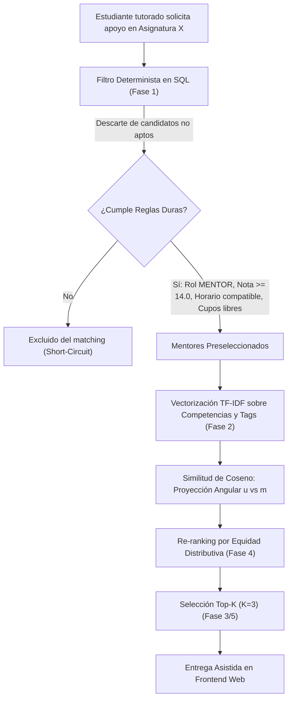

# Sistema Web P2P de Mentorías Académicas - EPIS UPT

[](https://www.python.org/)
[](https://streamlit.io/)
[](https://scikit-learn.org/)
[](https://sqlite.org/)
[](https://www.upt.edu.pe/)

Plataforma web peer-to-peer (P2P) con motor de recomendación híbrido para la personalización de mentorías académicas entre pares en la Escuela Profesional de Ingeniería de Sistemas (EPIS) de la Universidad Privada de Tacna (semestre 2026-II).

---

## 🎯 Arquitectura del Pipeline de Recomendación

El motor opera bajo una arquitectura desacoplada en dos etapas (*Two-Stage Recommendation Pipeline*) complementada con calibración de equidad distributiva (*Fairness Re-ranking*):



### Formulación Matemática del Modelo:
$$\text{PuntajeFinal}(m) = \alpha \cdot \text{SimCoseno}(u, m) - \beta \cdot \left(\frac{\text{SesionesActivas}(m)}{\text{MaxCupos}(m)}\right) + \gamma \cdot \text{BonoNuevo}(m)$$

Donde los hiperparámetros son administrados dinámicamente desde `config/system_rules.json`:
* **$\alpha = 0.70$:** Ponderación de afinidad temático-semántica por coseno.
* **$\beta = 0.20$:** Factor de penalización por saturación de carga operativa.
* **$\gamma = 0.10$:** Bono de oportunidad y equidad para mentores nuevos.

---

## 📁 Estructura del Repositorio

El proyecto implementa una arquitectura modular y limpia:

```text
AlgoritmoP2P/
├── config/
│   └── system_rules.json           # Fuente única de verdad (pesos, quórums, umbrales)
├── data/
│   ├── epis_mentorias.db           # Base de datos SQLite (cohorte de 350 estudiantes)
│   └── epis_mentorias.json         # Exportación estructurada del dataset
├── docs/
│   ├── EXPLICACION_SISTEMA.md      # Fundamentación metodológica y formulación matemática
│   └── reglas_sistema.md           # Directivas técnicas y reglas de negocio del sistema
├── notebooks/
│   └── visualizador_algoritmo.ipynb # Cuaderno interactivo Jupyter estructurado por fases
├── reportes/                       # Repositorio institucional de auditoría (.md y .json)
│   └── .gitkeep
├── scripts/
│   ├── generar_bd_epis.py          # Generador de la cohorte sintética (40 mentores, 310 tutorados)
│   ├── generar_notebook.py         # Generador automatizado del cuaderno Jupyter
│   └── sync_docs.py                # Script de sincronización automática de documentación
├── src/
│   ├── __init__.py
│   ├── motor_recomendacion.py      # Núcleo algorítmico (Fases 1 a 5, SQL + TF-IDF + Re-ranking)
│   └── gestor_reportes.py          # Subsistema de persistencia y exportación de reportes
├── tests/
│   └── test_algoritmo_progresivo.py # Suite de pruebas unitarias progresivas (Fase 1 y 2)
├── app_visualizador.py             # Aplicación principal interactiva web (Streamlit)
├── .gitignore                      # Exclusiones de temporales, cachés y artefactos
├── requirements.txt                # Dependencias declaradas del entorno
└── README.md                       # Documentación principal del repositorio
```

---

## 🚀 Guía de Instalación y Ejecución

### 1. Requisitos Previos e Instalación de Dependencias
Asegúrate de contar con Python 3.10 o superior:
```bash
pip install -r requirements.txt
```

### 2. Ejecutar la Aplicación Web Interactiva (Streamlit)
Inicia el visualizador interactivo con simulaciones reactivas por tutorado, proyección vectorial angular polar ($\theta \to 0^\circ$), contraste de calificaciones y generador de reportes descargables:
```bash
streamlit run app_visualizador.py
```

### 3. Ejecutar la Suite de Pruebas Automatizadas
Verifica las reglas duras relacionales y el espacio vectorial mediante los tests unitarios:
```bash
python tests/test_algoritmo_progresivo.py
```

### 4. Abrir el Cuaderno de Experimentación (Jupyter)
Explora la validación paso a paso de cada fase algorítmica:
```bash
jupyter notebook notebooks/visualizador_algoritmo.ipynb
```

### 5. Sincronizar Documentación y Parámetros
Si modificas los pesos o quórums en `config/system_rules.json`, sincroniza automáticamente toda la documentación:
```bash
python scripts/sync_docs.py
```

---

## 📊 Parámetros Globales de Operación

| Parámetro | Valor | Descripción |
| :--- | :--- | :--- |
| **Población Objetivo** | 350 | Estudiantes matriculados estimados (I al X ciclo) |
| **Mentores Avanzados** | 40 | Estudiantes de Ciclos VII a X con mérito académico |
| **Tutorados** | 310 | Estudiantes de Ciclos I a VI demandantes de tutoría |
| **Nota Mínima Aprobatoria** | $\ge 14.0$ | Calificación vigesimal mínima en el curso para ser mentor |
| **Ponderación Coseno ($\alpha$)** | 0.70 | Peso de la afinidad semántica en intereses |
| **Penalización Sobrecarga ($\beta$)** | 0.20 | Deducción por porcentaje de cupos ocupados |
| **Bono Nuevo Mentor ($\gamma$)** | 0.10 | Incentivo para mentores sin historial |
| **Top-K Recomendados** | 3 | Cantidad de opciones presentadas al estudiante |
| **Quórum Clase Presencial** | 10 alumnos | Mínimo de alumnos para activar clase por demanda |
| **Quórum Clase Virtual** | 20 alumnos | Mínimo de alumnos para activar clase por demanda |

---

## 🔒 Privacidad y Protección de Datos (Ley N° 29733)
* **Cero Scraping Intranet:** El sistema no captura ni almacena contraseñas institucionales.
* La ingesta se realiza exclusivamente mediante carga administrativa estructurada (Excel/CSV) o lectura local de Kardex oficial en formato PDF.